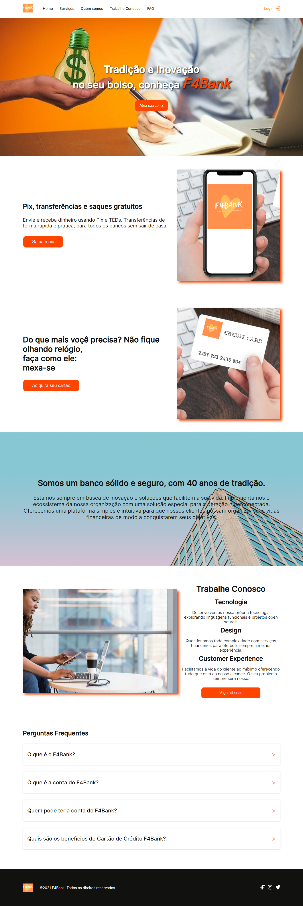

<h1 align="center">
     Projeto Landing Page F4Bank
</h1>

---
##  🕵Sobre

 O F4Bank é um projeto de criação de Landing Page para um banco fictício. O desafio foi criar uma landing page que comunicasse, além da proposta do banco, os produtos "Cartão sem taxa" e "Conta corrente digital", reforçando a segurança de um banco tradicional com décadas de história no país.

##  👩🏾Quem Faz 

 - Flávio José Fonseca Filho
 - Laís de Medeiros Silva
 - Luiz Gustavo Santos
 
---

##  🧭Status do Projeto

 - ⌛ Feito

---

##  🎯Objetivo do Projeto

Este é um projeto de Front-end , desenvolvido no bootcamp da Labenu, cujo o principal objetivo é estudar e praticar HTML, CSS e responsividade. 

## ☑️Requisitos de Funcionalidade

- [x] Quem somos
- [x] Nossos produtos e serviços
- [x] Contato
- [x] FAQ
- [x] Trabalhe conosco
- [x] Responsividade

---

## 🔗Link para Acessar

- [F4Bank](https://flashy-scene.surge.sh)

---
